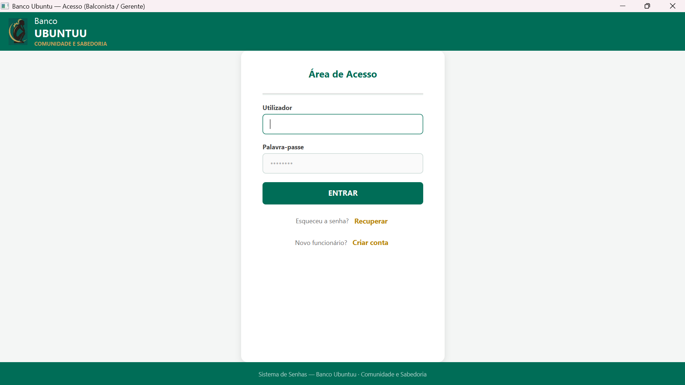
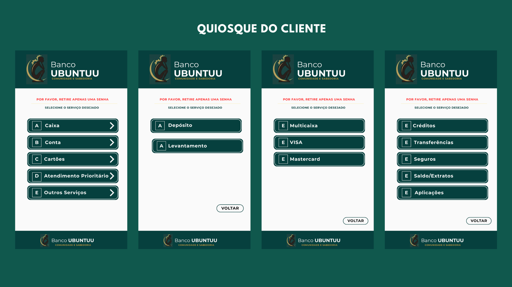
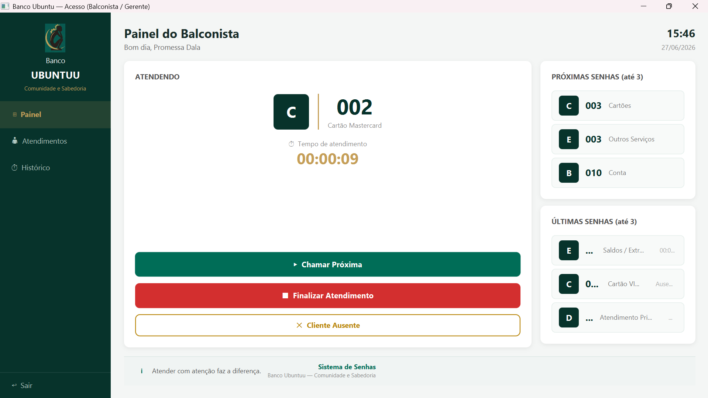
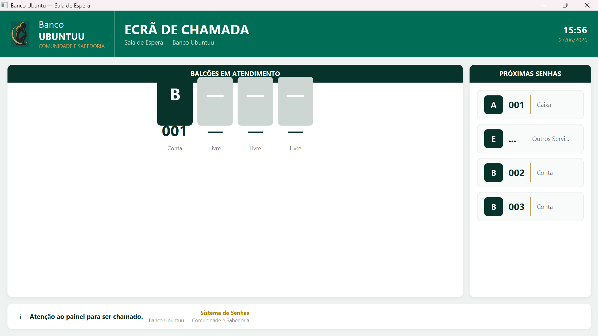
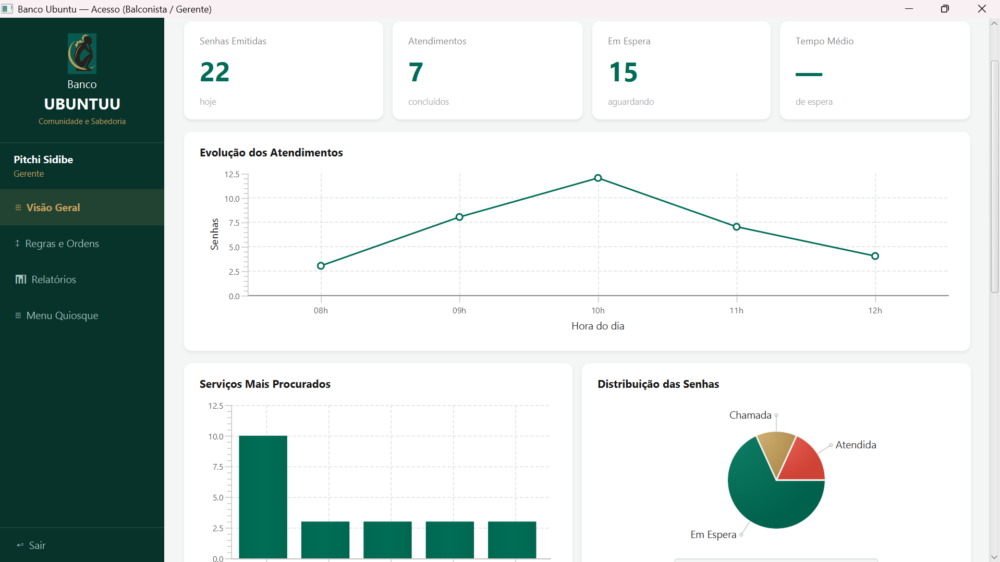

<div align="center">

# SGF – Sistema de Gestão de Filas

Sistema desktop desenvolvido em **Java** para gestão inteligente de filas em ambientes bancários.


</div>

---

# Sobre o Projeto

O **SGF (Sistema de Gestão de Filas)** é uma aplicação desktop desenvolvida em **Java**, concebida para automatizar e otimizar o atendimento em instituições bancárias.

O sistema permite organizar as filas de espera, respeitar prioridades de atendimento e disponibilizar informações estratégicas que auxiliam os gestores na tomada de decisões.

Entre os indicadores disponibilizados encontram-se:

- Número de clientes atendidos;
- Serviços mais procurados;
- Horários de maior movimento;
- Tempo médio de espera;
- Tempo médio de atendimento;
- Desempenho dos colaboradores;
- Estatísticas em tempo real.

Este projeto foi desenvolvido em equipa no âmbito da unidade curricular de **Programação**, permitindo aplicar diversos conceitos fundamentais de Engenharia de Software e Desenvolvimento de Aplicações.

---

# Demonstração

## Login



---

## Quiosque de Emissão de Senhas



---

## Painel do Balconista



---

## Sala de Espera



---

## Painel do Gerente



---

# Funcionalidades

- Emissão automática de senhas
- Atendimento por prioridade
- Gestão dinâmica das filas
- Login de utilizadores
- Painel do Balconista
- Painel Administrativo
- Sala de Espera em tempo real
- Estatísticas
- Registo de Logs
- Exportação para Excel
- Geração de PDF
- QR Code nas senhas
- Controlo de acessos
- Auditoria das operações

---

# Tecnologias Utilizadas

| Tecnologia | Função |
|------------|---------|
| Java | Linguagem principal |
| JavaFX | Interface gráfica |
| Scene Builder | Desenvolvimento das telas |
| CSS | Estilização |
| Maven | Gestão de dependências |
| MySQL | Base de Dados |
| JDBC | Comunicação com MySQL |
| Apache PDFBox | Geração de PDF |
| Apache POI | Relatórios Excel |
| BCrypt | Hash de passwords |
| ZXing | Geração de QR Code |

---

# Arquitetura

O projeto segue uma arquitetura baseada nos padrões **MVC**, **DAO** e **Service Layer**, promovendo uma separação clara entre interface, lógica de negócio e acesso aos dados.

```text
                    JavaFX (FXML)

                           │

                           ▼

                    Controllers

                           │

                           ▼

                     Services

                           │

                           ▼

                         DAO

                           │

                           ▼

                 DatabaseConnection

                           │

                           ▼

                         MySQL
```

---

# Estrutura do Projeto

```text
src
│
├── controller
│   ├── LoginController.java
│   ├── MenuController.java
│   ├── PainelBalconistaController.java
│   ├── PainelGerenteController.java
│   ├── EcraChamadaController.java
│   └── ...
│
├── dao
│   ├── SenhaDAO.java
│   ├── AtendimentoDAO.java
│   ├── LogDAO.java
│   └── UtilizadorDAO.java
│
├── database
│   ├── DatabaseConnection.java
│   └── db.properties
│
├── model
│   ├── Senha.java
│   ├── Servico.java
│   ├── AtendimentoBalcao.java
│   ├── LogAtividade.java
│   └── ServicoInfo.java
│
├── service
│   ├── FilaService.java
│   ├── PdfService.java
│   ├── ExcelService.java
│   └── LogService.java
│
├── util
│
└── App.java
│
resources
│
├── css
├── fxml
├── imagens
└── icons
```

---

# Organização das Pastas

## Controller

Responsável por controlar todas as interfaces da aplicação.

Recebe os eventos da interface gráfica, comunica com a camada Service e atualiza as Views.

---

## Model

Contém as entidades do sistema.

Exemplos:

- Senha
- Serviço
- Atendimento
- Utilizador
- Log

---

## DAO

Responsável pelo acesso à Base de Dados.

Toda a comunicação SQL encontra-se nesta camada.

Principais operações:

- INSERT
- UPDATE
- DELETE
- SELECT

---

## Service

Implementa as regras de negócio da aplicação.

Exemplos:

- Gestão da fila
- Prioridade de atendimento
- Geração de PDF
- Exportação Excel
- Registo de Logs

---

## Database

Contém a configuração da ligação JDBC com o MySQL.

Principais ficheiros:

- DatabaseConnection.java
- db.properties

---

## Resources

Armazena todos os recursos da aplicação.

- Interfaces FXML
- CSS
- Imagens
- Ícones

---

# Programação Orientada a Objetos

Durante o desenvolvimento foram aplicados diversos conceitos fundamentais:

- Encapsulamento
- Herança
- Polimorfismo
- Abstração
- Classes e Objetos
- Enums
- Singleton
- Facade
- DAO Pattern
- MVC

---

# Estruturas de Dados

O sistema utiliza estruturas de dados para organizar e otimizar o atendimento.

Principais estruturas utilizadas:

- Queue (Fila)
- ArrayList
- HashMap
- Collections Framework

A gestão das filas respeita o princípio **FIFO (First In, First Out)**, garantindo que os clientes são atendidos pela ordem correta, exceto quando existem senhas prioritárias.

---

# Base de Dados

O sistema utiliza **MySQL** como Sistema de Gestão de Base de Dados.

A ligação é realizada através da API **JDBC**.

```text
Aplicação

↓

DatabaseConnection

↓

DriverManager

↓

Connection

↓

PreparedStatement

↓

ResultSet

↓

MySQL
```

Principais tabelas:

- utilizador
- senha
- servico
- atendimento
- log_atividade
- nivel_acesso

---

# Como Executar

## 1. Clonar o repositório

```bash
git clone https://github.com/SEU-USUARIO/SGF.git
```

---

## 2. Entrar na pasta

```bash
cd SGF
```

---

## 3. Criar a Base de Dados

```sql
CREATE DATABASE sistema_senhas;
```

Importe o ficheiro SQL presente no projeto.

---

## 4. Configurar a ligação

Editar:

```text
database/db.properties
```

```properties
url=jdbc:mysql://localhost:3306/sistema_senhas

user=root

password=sua_password
```

---

## 5. Executar

```bash
mvn clean javafx:run
```

---

# Aprendizagens

Este projeto permitiu consolidar conhecimentos em:

- Programação Orientada a Objetos
- Estruturas de Dados
- Java Collections Framework
- JavaFX
- Arquitetura MVC
- DAO Pattern
- Service Layer
- Maven
- MySQL
- JDBC
- Engenharia de Software
- Trabalho em Equipa

---

# Equipa

- Pitchi Sidibe
- Junior Teófilo
- Edgar Lourenço
- João Vaz
- André Castro
- Promessa Dala
- Metussalém Bunga
- Kelia Silva

---

# Licença

Este projeto foi desenvolvido exclusivamente para fins académicos, no âmbito da unidade curricular de **Programação**.

---

<div align="center">

Desenvolvido com Java ☕ por **Pitchi Sidibe** e equipa.

</div>
